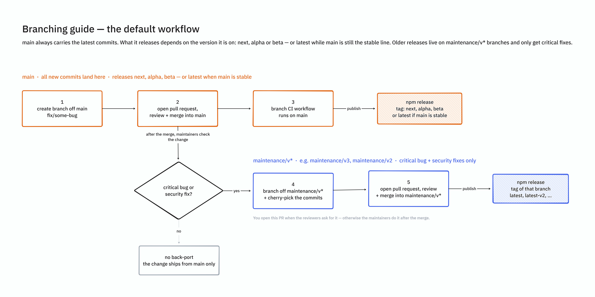
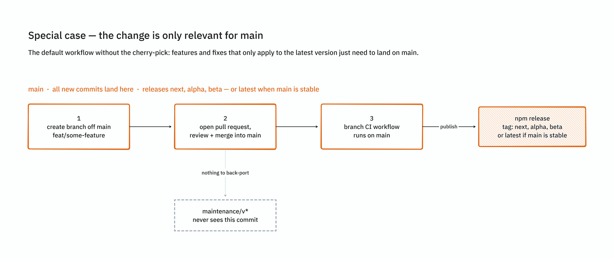
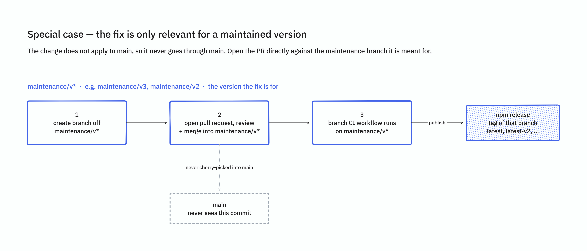

# Contributing

Contributions are **welcome** and will be fully **credited**.

Please read and understand the [contribution guide](https://tiptap.dev/docs/resources/contributing) before creating an issue or pull request.

## Etiquette

This project is open source, and as such, the maintainers give their free time to build and maintain the source code
held within. They make the code freely available in the hope that it will be of use to other developers. It would be
extremely unfair for them to suffer abuse or anger for their hard work.

Please be considerate towards maintainers when raising issues or presenting pull requests. Let's show the
world that developers are civilized and selfless people.

It's the duty of the maintainer to ensure that all submissions to the project are of sufficient
quality to benefit the project. Many developers have different skillsets, strengths, and weaknesses. Respect the maintainer's decision, and do not be upset or abusive if your submission is not used.

## Security

If you discover a security vulnerability, please refer to our [Security Policy](SECURITY.md) for reporting instructions.

## Branching

`main` is the default branch and always holds the newest code. That's not the same as "stable".
While a new major version is being developed, `main` can be a pre-release (`next`, `alpha`,
`beta`) for months before it ships. Check the npm dist-tag (`latest`, `next`, `alpha`, ...), not
the branch, to know what is currently stable.

Older major versions live on `maintenance/v*` branches (e.g. `maintenance/v3`). These only
receive critical bug fixes and security patches, no new features.

| Branch           | Purpose                                 | Publishes                                                                      |
| ---------------- | --------------------------------------- | ------------------------------------------------------------------------------ |
| `main`           | Active development, default branch      | `next` / `alpha` / `beta`, or `latest` once main is the current stable version |
| `maintenance/v*` | Frozen stable line, critical fixes only | `latest` (while current) or `latest-v*` (once superseded)                      |

Once a `maintenance/v*` branch is cut, it never merges back into `main`, and `main` never
merges into it. Merging two branches with that much diverged history just produces huge
conflicts. Individual fixes still travel between them, one commit at a time, by cherry-pick.

### Where to open your pull request

- Open your PR against `main`. That's the default target and where all new development happens.
- Only target a `maintenance/v*` branch directly if your fix applies exclusively to that old
  version and not to `main` (see "Change only relevant for a maintained version" below).

### Does your fix need to reach the current stable release too?

A fix merged into `main` during a pre-release cycle does not reach users on the current stable
release by itself, because `main` and the maintenance branch never merge. If your fix addresses
a critical bug or security issue that also affects the current stable release, it needs a
second PR that cherry-picks your commit onto the relevant `maintenance/v*` branch.

- Check the box in the pull request template if this applies to your change.
- Open the backport PR yourself if you can. You know the fix best.
- If you can't, a maintainer may do it as a last resort, but that's not guaranteed, so try first.

### The three cases

#### Default workflow

Most changes. Lands on `main`, ships under whatever tag `main` is currently publishing, no
backport needed.

#### Change only relevant for `main`

A change that does not apply to any maintained stable version, for example a new-major-only
feature. Lands on `main` only. `maintenance/v*` never sees it.

#### Change only relevant for a maintained version

A fix specific to an already-stable release. Open the PR directly against `maintenance/v*`.
It never touches `main`.

## Viability

When requesting or submitting new features, first consider whether it might be useful to others. Open
source projects are used by many developers, who may have entirely different needs to your own. Think about
whether or not your feature is likely to be used by other users of the project.

## Procedure

Before filing an issue:

- Attempt to replicate the problem, to ensure that it wasn't a coincidental incident. Create a CodeSandbox to reproduce the issue. Use one of these templates to get started:
  - [JavaScript template](https://codesandbox.io/s/tiptap-js-fv1lyo)
  - [React template](https://codesandbox.io/s/tiptap-react-qidlsv)
  - [Vue 3 template](https://codesandbox.io/p/sandbox/tiptap-vue-3-ci7q9h)
- Check to make sure your feature suggestion isn't already present within the project.
- Check the pull requests tab to ensure that the bug doesn't have a fix in progress.
- Check the pull requests tab to ensure that the feature isn't already in progress.

Before submitting a pull request:

- Check the codebase to ensure that your feature doesn't already exist.
- Check the pull requests to ensure that another person hasn't already submitted the feature or fix.
- Check which branch to target. See [Branching](#branching) above.

Before committing:

- Make sure to run the tests and linter before committing your changes.
- If you are making changes to one of the packages, make sure to **always** include a [changeset](https://github.com/changesets/changesets) in your PR describing **what changed** with a **description** of the change. Those are responsible for changelog creation

## Create a new demo

To make it easier to add new demos to the demos app we provide a small helper script via `pnpm run make:demo` that scaffolds a new demo directory from our default template.

**What it does**

- Prompts for a demo name and category.
- Validates the category is one of: `Dev`, `Examples`, `Extensions`, `Experiments`, `Marks`, `Nodes`.
- Copies the template `demos/src/Examples/Default` to `demos/src/<Category>/<Demo_Name>`.

**How to use**

- From the repository root run:
- If the script is executable:
- Or with bash directly:
- Follow the interactive prompts for the demo name and category.

**Notes and follow-up steps**

- The script only copies the template. After the scaffold is created, update the demo's files (title, description, imports) to reflect your example.
- Make sure to review the generated demo in `demos/` and run the demos app (`pnpm dev`) to verify it appears and works as expected.
- If your demo changes package behaviour or exposes user-facing changes, follow the normal rule and add a changeset and tests as needed.
- If you don't want your demo to be included in the Git repository, use the `Dev` category. Demos in this category are ignored by git via `.gitignore`.

## Publishing New Packages

When adding a new package to the repository that does not yet exist on NPM, additional setup is required before the automated publish CI can release it:

1. **Manual initial publish** - The package must be published manually to NPM for the first time using normal user authentication. This is required because trusted publishing can only be configured for packages that already exist on the registry.
   - For a single package, run `pnpm run build && pnpm publish` from the package directory (e.g., `packages/extension-audio/`).
   - Alternatively, run `pnpm run publish` from the root directory to publish all packages.
2. **Configure trusted publishing** - After the initial publish, set up [NPM trusted publishing](https://docs.npmjs.com/trusted-publishers) (also known as provenance) for the package on NPM. This allows the GitHub Actions workflow to publish subsequent versions automatically.

Without this setup, the publish CI will fail when attempting to release a new package.

### Adding a new release branch

When work on a new major version starts on `main`, cut the current stable line into its own
`maintenance/v*` branch (e.g., `maintenance/v2`) before the first breaking change merges. See
[Branching](#branching) for the full model. Then update two places:

1. **Workflow trigger** — Add the branch name to the `on.push.branches` list in `.github/workflows/publish.yml`.
2. **Publish configuration** — Add a matching entry in `.github/publish-config.json` with the desired dist-tag and release messages.

Both lists must stay in sync. A branch present in one but not the other will either never trigger the workflow or produce a harmless no-op.

Each entry in `.github/publish-config.json` takes four fields:

| Field     | Description                                                                                |
| --------- | ------------------------------------------------------------------------------------------ |
| `distTag` | npm dist-tag passed to `pnpm changeset publish --tag`, e.g. `latest`, `next`, `latest-v2`. |
| `label`   | Label used in the Slack release announcement, e.g. `stable` or `prerelease`.               |
| `title`   | Title of the Changesets version PR created by CI.                                          |
| `commit`  | Commit message of that version PR.                                                         |

The resolver job looks up the current branch by exact name. If it is missing, the workflow exits cleanly without building, publishing, or notifying. Make sure the dist-tag exists on npm (`npm dist-tag add <package>@<version> <tag>`) before the first release from a new branch.

## Requirements

If the project maintainer has any additional requirements, you will find them listed here.

- **Document any change in behaviour** - Make sure the `README.md` and any other relevant documentation are kept up-to-date.

- **One pull request per feature** - If you want to do more than one thing, send multiple pull requests.

- **Send coherent history** - Make sure each individual commit in your pull request is meaningful. If you had to make multiple intermediate commits while developing, please [squash them](https://www.git-scm.com/book/en/v2/Git-Tools-Rewriting-History#Changing-Multiple-Commit-Messages) before submitting.

- **Disclose AI usage** — If you used AI tools (e.g., ChatGPT, Claude, GitHub Copilot) to generate any part of your contribution, you must clearly disclose this in your pull request description.

- **Link your pull request to an issue** — Pull requests must be linked to an existing issue that has been assigned to you. Before opening a PR, ensure there is an issue describing the bug or feature you're addressing. Trivial fixes (e.g., typos, broken links) are exempt.

- **Respond to feedback** — Maintainers may ask follow-up questions or request changes on your pull request. If you do not respond within 30 days, your PR may be closed. You are welcome to reopen it or submit a new PR once you're able to address the feedback.

**Happy coding**!
