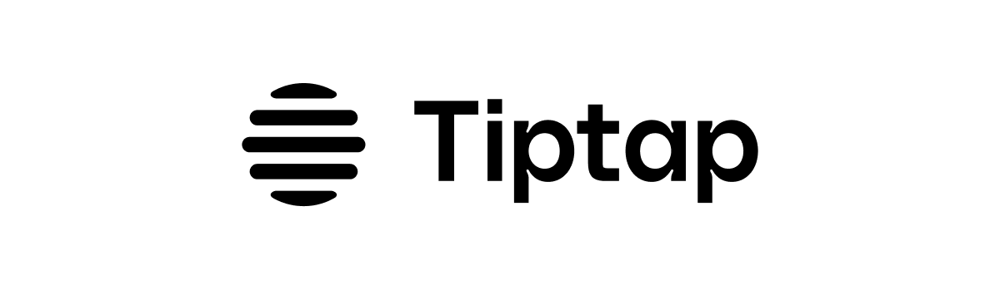

[](https://github.com/ueberdosis/dibdab/actions/workflows/build.yml)
[](https://www.npmjs.com/package/@dibdab/core)
[](https://npmcharts.com/compare/@dibdab/core?minimal=true)
[](https://www.npmjs.com/package/@dibdab/core)

# DibDab Editor

DibDab is a fork of the Tiptap Editor - a headless, framework-agnostic rich text editor that's customizable and extendable through extensions. Its headless nature means it comes without a set user interface, offering full design freedom (for a jumpstart, see linked [UI templates](#examples-codesandbox-and-ui-templates) below). DibDab is based on the highly reliable [ProseMirror](https://github.com/ProseMirror/prosemirror) library.

> **Attribution:** DibDab is a fork of [Tiptap Editor](https://github.com/ueberdosis/tiptap) created by [überdosis](https://github.com/ueberdosis). We are grateful for their excellent work and the open-source community's contributions.

### How does the DibDab Editor work?

- **Headless Framework:** DibDab does not rely on a user interface. So there is no need for class overrides or code hacks. If you do need an example UI feel free to browse our [UI templates](#examples-codesandbox-and-ui-templates) linked below.
- **Framework-agnostic:** The DibDab Editor is designed to work across different frontend frameworks. This means whether you're using Vue, React, or plain JavaScript, DibDab integrates without compatibility issues.
- **Extension based:** Extensions in DibDab allow for a tailored editing experience, from simple text styling to advanced features like drag-and-drop block editing. You have the option to choose from over 100 extensions to enhance your editor's functionality.
- **Customize your UX:** The editor was built to give you control to define your own extensions and nodes.

## Installation

```bash
npm install @dibdab/core
```

For framework-specific packages:

```bash
# React
npm install @dibdab/react

# Vue 3
npm install @dibdab/vue-3

# Vue 2
npm install @dibdab/vue-2
```

## Basic Usage

```javascript
import { Editor } from '@dibdab/core'
import StarterKit from '@dibdab/starter-kit'

const editor = new Editor({
  element: document.querySelector('#editor'),
  extensions: [
    StarterKit,
  ],
  content: '<p>Hello DibDab!</p>',
})
```

## About DibDab

DibDab is a community-driven fork of Tiptap, focused on providing a robust, open-source rich text editing experience. This fork maintains the same high-quality editing capabilities while being community-maintained.

For information about the original Tiptap project, visit the [Tiptap documentation](https://tiptap.dev/docs/editor/introduction) or [website](https://tiptap.dev/).

## Community

For help, discussion about best practices, or any other conversation that would benefit from being searchable:

[Discuss DibDab on GitHub](https://github.com/ueberdosis/dibdab/discussions)

## Original Project Sponsors

The original Tiptap project was made possible by these amazing sponsors:

[iFixit](https://www.ifixit.com/), [ApostropheCMS](https://apostrophecms.com/), [Complish](https://www.complish.app/), [Storyblok](https://www.storyblok.com/), [PostHog](https://posthog.com/), [Reflect](https://reflect.app/), [Ziff Media](https://ziffmedia.com/), [Basewell](https://www.basewell.com/), [Poggio](https://poggio.io), [Novadiscovery](http://www.novadiscovery.com/), [Omics Data Automation](https://www.omicsautomation.com), [Flow Mobile](https://www.flowmobile.app/), [DocIQ](https://www.dociq.io/) and [hundreds of awesome individuals](https://github.com/sponsors/ueberdosis).

## Contributing

Feel like adding some magic of your own to DibDab? We welcome contributions! Please see our [CONTRIBUTING](CONTRIBUTING.md) guidelines for how to get started.

## Original Project Contributors

[Sam Willis](https://github.com/samwillis),
[Brian Hung](https://github.com/BrianHung),
[Dirk Holtwick](https://github.com/holtwick),
[Sam Duvall](https://github.com/SamDuvall),
[Christoph Flathmann](https://github.com/Chrissi2812),
[Erick Wilder](https://github.com/erickwilder),
[Marius Tolzmann](https://github.com/mariux),
[jjangga0214](https://github.com/jjangga0214),
[Maya Nedeljkovich](https://github.com/mayacoda),
[Ryan Bliss](https://github.com/ryanbliss),
[Gregor](https://github.com/gambolputty) and [many more](../../contributors).

## License

The MIT License (MIT). Please see [License File](LICENSE.md) for more information.
